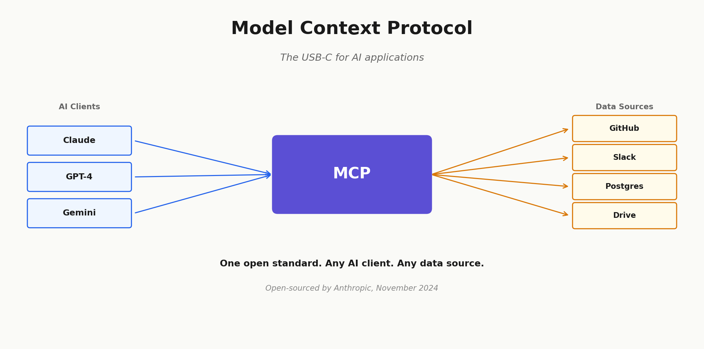
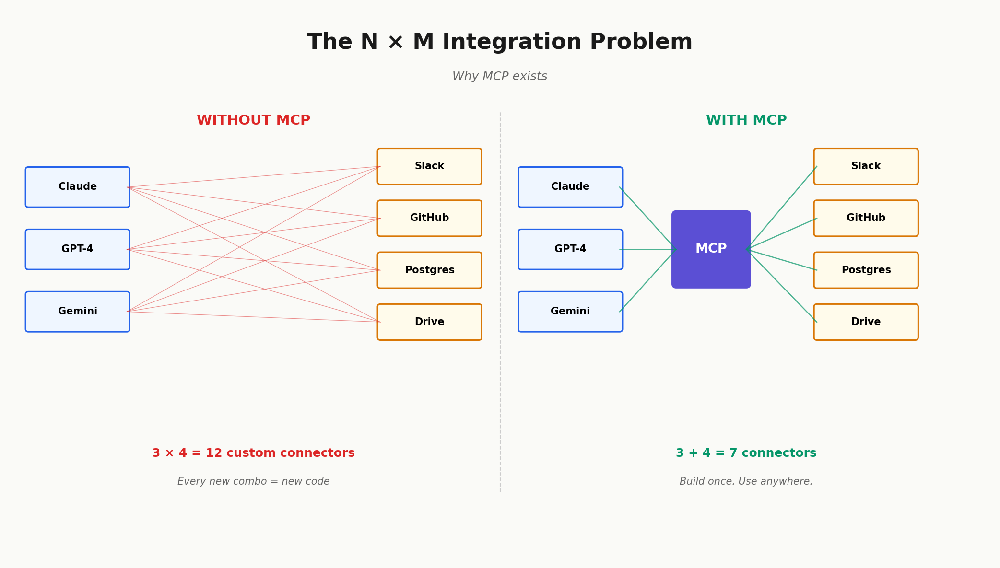
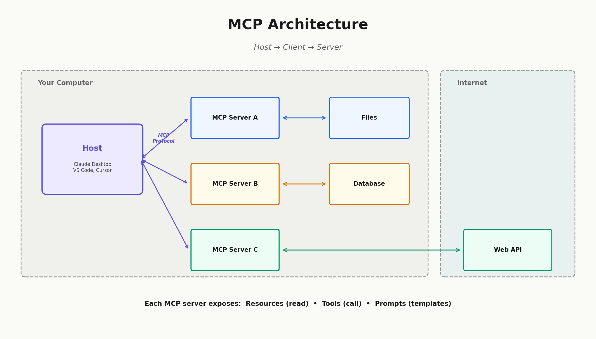

# MCP Server Research

Exploring Anthropic's **Model Context Protocol** — what it is, how it works, and why it matters for AI integrations.

Came across this while studying how LLMs can actually connect to real data sources without custom one-off integrations for every tool.



---

## What is MCP?

MCP (Model Context Protocol) is an open standard released by Anthropic in Nov 2024. Think of it like **USB-C but for AI** — instead of building a separate connector every time you want an AI to talk to Slack, GitHub, or a database, you build one MCP server and any MCP-compatible client can use it.

**Two sides of the protocol:**
- **MCP Server** — exposes your data/tool (e.g. your Postgres DB, your Drive)
- **MCP Client** — the AI app that connects to those servers (e.g. Claude Desktop)

---

## Why it's interesting

Before MCP, every AI integration was a snowflake. You'd write custom code to pull data from tool A, format it for the model, handle auth — and repeat for every tool. That's the classic N×M problem: N models talking to M tools means N×M custom connectors.



MCP collapses that to N+M. Build one server per tool, any MCP-compatible client uses it. Plus it's **two-way** — servers can expose tools the model can *call*, not just read.

---

## Architecture



Three things an MCP server can expose:
1. **Resources** — readable data (files, DB rows, API responses)
2. **Tools** — callable functions (send email, create task, query DB)
3. **Prompts** — pre-built prompt templates for common workflows

---

## Pre-built servers (from Anthropic)

| Server | What it connects to |
|--------|-------------------|
| `github` | Repos, issues, PRs |
| `google-drive` | Files and docs |
| `slack` | Messages and channels |
| `postgres` | Database queries |
| `puppeteer` | Browser automation |
| `git` | Local git operations |

Full list: [github.com/modelcontextprotocol/servers](https://github.com/modelcontextprotocol/servers)

---

## How to run a basic MCP server (Python)

```python
from mcp.server import Server
from mcp.server.stdio import stdio_server

app = Server("my-first-server")

@app.list_resources()
async def list_resources():
    return [
        {
            "uri": "notes://daily",
            "name": "Daily Notes",
            "mimeType": "text/plain"
        }
    ]

@app.read_resource()
async def read_resource(uri: str):
    if uri == "notes://daily":
        return "Today's notes: reviewed MCP architecture."

async def main():
    async with stdio_server() as streams:
        await app.run(*streams)
```

Install: `pip install mcp`
Run: `python server.py`

---

## Connecting to Claude Desktop

In `claude_desktop_config.json`:

```json
{
  "mcpServers": {
    "my-notes": {
      "command": "python",
      "args": ["/path/to/server.py"]
    }
  }
}
```

Restart Claude Desktop and your server shows up under the tools menu.

---

## Real-world adoption

- **Block** — using MCP for agentic internal systems
- **Apollo** — integrated MCP into their platform
- **Zed, Replit, Codeium, Sourcegraph** — all working with MCP for coding context
- **OpenAI, Google DeepMind** — adopted the protocol after Anthropic open-sourced it

---

## Resources

- Official site: [modelcontextprotocol.io](https://modelcontextprotocol.io)
- Announcement: [anthropic.com/news/model-context-protocol](https://www.anthropic.com/news/model-context-protocol)
- GitHub org: [github.com/modelcontextprotocol](https://github.com/modelcontextprotocol)
- Quickstart: [modelcontextprotocol.io/quickstart](https://modelcontextprotocol.io/quickstart)

---

## Status

- [x] Read the announcement + architecture docs
- [x] Understood client/server split
- [x] Ran through Python SDK basics
- [ ] Build a working MCP server (next step)
- [ ] Connect to Claude Desktop and test
